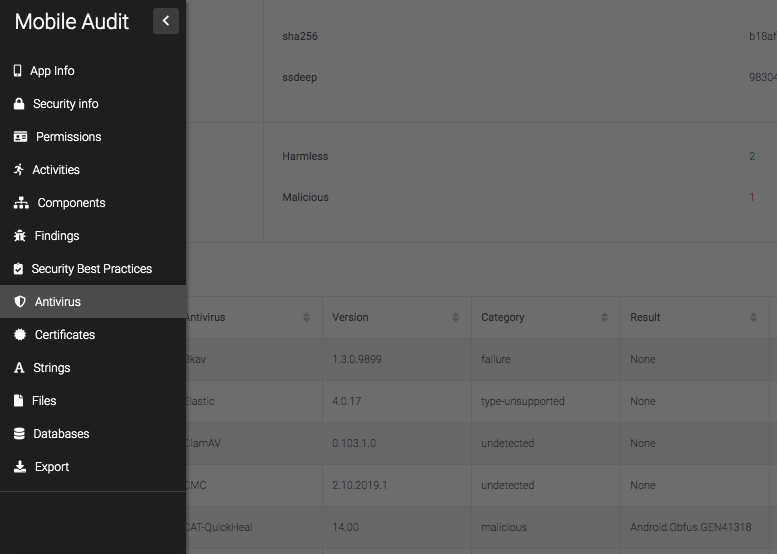
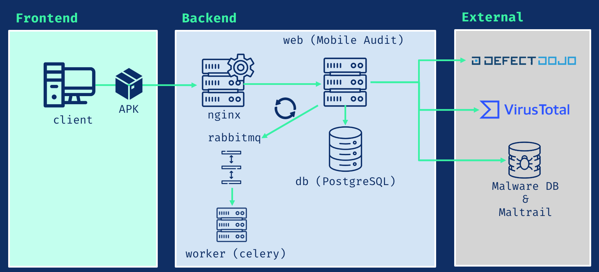

---

layout: col-sidebar
title: OWASP Mobile Audit
tags: mobile-audit
level: 2
type: tool
pitch: DevSecOps Tool to perform SAST and Malware analysis in Android APKs

---

## Mobile Audit - Static Analysis and detecting malware in Android APKs

### Who is Mobile Audit for?

Mobile Audit focuses not only in the security testing and defensive use cases, the goal
of the project is to become a complete homologation for Android APKs, which includes:
- Static Analysis (SAST): It will perform a full decompilation of the APK and extract all the possible information of it. It reports the different vulnerabilities and findings in the source code grouped by different categories.  Also, it has full support on finding triage (change status and criticality).
- Malware Analysis: finds dangerous permissions and suspicious code.
- Best Practices of Secure Android Coding: tells developers in which parts of the code they are coding securely and where they are not.

It is aimed to different user profiles:

- Developers
- System Administrators
- Security Engineers

In each of the scans, it would have the following information:

* Application Info
* Security Info
* Components
* SAST Findings
* Best Practices Implemented
* Virus Total Info
* Certificate Info
* Strings
* Databases
* Files

For easy access there is a sidebar on the left page of the scan:

### Components

- **db**: PostgreSQL 13.2
- **nginx**: Nginx 1.19.10
- **rabbitmq**: RabbitMQ 3.8.14
- **worker**: Celery 5.0.5
- **web**: Mobile Audit App

### Main features

- [x] Uses Docker for easy deployment in multiplatform environment
- [x] Extract all information of the APK
- [x] Analyze all the source code searching for weaknesses
- [x] All findings are categorized and follows CWE standards
- [x] Also highlight the Best Practices in Secure Android Implementation in the APK
- [x] The findings can be edited and the false positives can be triaged and deleted
- [x] All scan results can be exported to PDF
- [x] User authentication and user management
- [x] API v1 with Swagger and ReDoc
- [x] TLS
- [x] Dynamic page reload (WIP)
- [ ] Export to Markdown
- [ ] Export to CSV
- [ ] LDAP integration

### Integrations

#### Virus Total (API v3)

It checks if there has been an scan of the APK and extract all its information. Also, there is the possibility of uploading the APK is selected a property in the environment (Disabled by default).

#### Defect Dojo (API v2)

It is possible to upload the findings to the defect manager.

#### MalwareDB & Maltrail

It checks in the database if there are URLs in the APK that are related with Malware.

## Contribution

If you are interested in contributing with Mobile Audit:
 1. **Fork** this repo
 2. **Clone** the project to your own machine
 3. **Commit** changes to your own branch
 4. **Push** your work back up to your fork
 5. Submit a **Pull request** so that we can review your changes

## Licensing

This project is distributed under [GPL-3.0 License](https://github.com/mpast/mobileAudit/raw/main/LICENSE).
