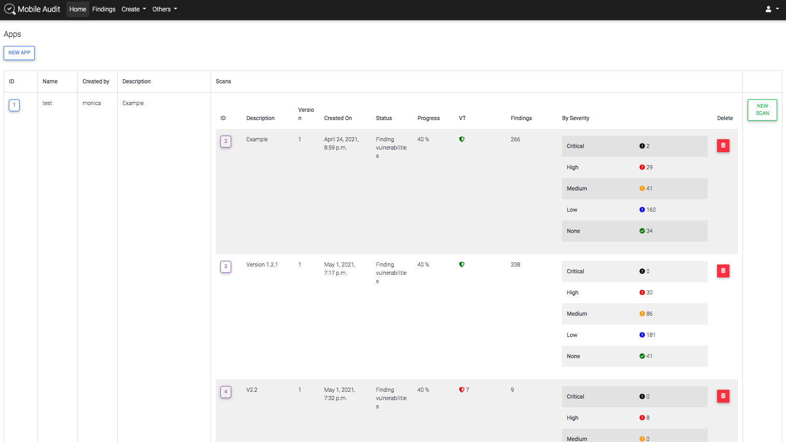
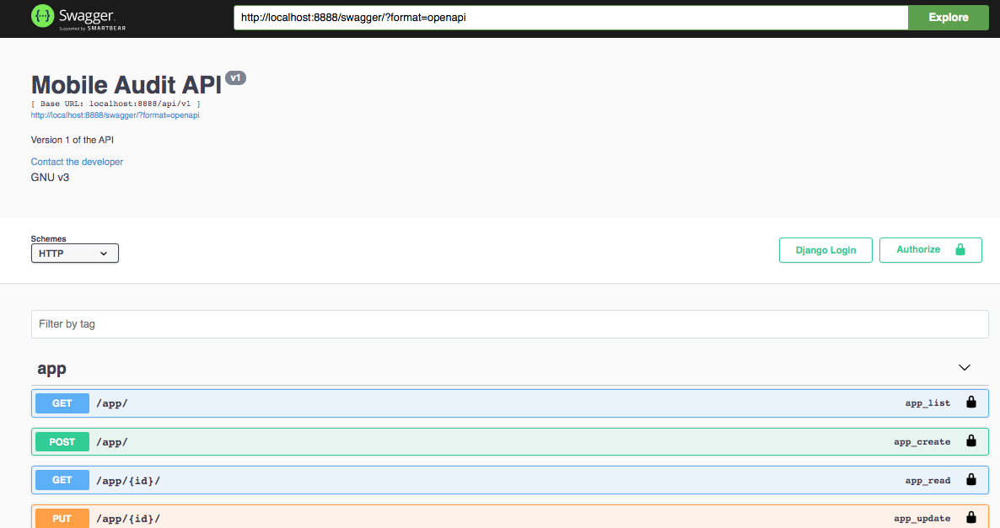
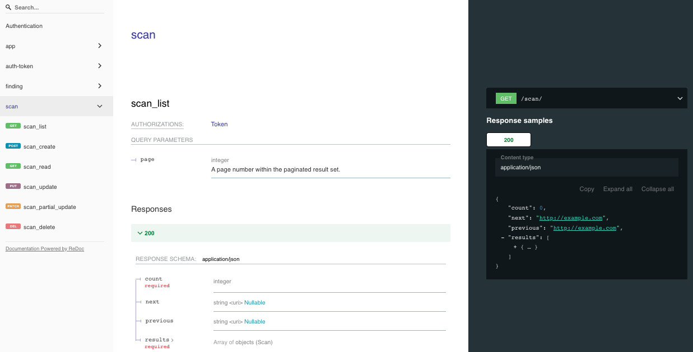

## Quickstart

### Installation

Using Docker-compose:

The provided `docker-compose.yml` file allows you to run the app locally in development. To start the container, run:

```sh
docker-compose up
```

If there are changes to the local Application Dockerfile, you can build the image with 

```sh
docker-compose build
```

Once the application has launched, you can test the application by navigating to: http://localhost:8888/ to access the dashboard.



Also, there is a TLS version running in port 443, so you can test the application by navigating to: https://localhost/ to access the dashboard.


In each of the scans, it would have the following information:

* Application Info
* Security Info
* Components
* SAST Findings
* Best Practices Implemented
* Virus Total Info
* Certificate Info
* Strings
* Databases
* Files

For easy access there is a sidebar on the left page of the scan:


### API v1

REST API integration with Swagger and ReDoc.

#### Usage

* Endpoint to authenticate and get token:
`/api/v1/auth-token/`

* Once authenticated, use header in all requests:
`Authorization: Token <ApiKey>`

#### Swagger




#### ReDoc




#### Endpoints

* A JSON view of the API specification at `/swagger.json`
* A YAML view of the API specification at `/swagger.yaml`
* A swagger-ui view of your API specification at `/swagger/`
* A ReDoc view of your API specification at `/redoc/`

### Configuration
#### Nginx configuration

* TLS - port 443: `nginx/app_tls.conf`
* Standard - port 8888: `nginx/app.conf`

#### Docker configuration

There are two volumes in `docker-compose.yml` with the configurations. By default both 443 and 8888 ports will be available, but **use only TLS configuration for production deployments**.

```yml
- ./nginx/app.conf:/etc/nginx/conf.d/app.conf
- ./nginx/app_tls.conf:/etc/nginx/conf.d/app_tls.conf
```

#### Environment variables

All the environment variables are in a `.env` file, there is an `.env.example` with all the variables needed. Also there are collected in `app/config/settings.py`:

```py
CWE_URL = env('CWE_URL', 'https://cwe.mitre.org/data/definitions/')

MALWAREDB_ENABLED = env('MALWAREDB_ENABLED', True)
MALWAREDB_URL = env('MALWAREDB_URL', 'https://www.malwaredomainlist.com/mdlcsv.php')

VIRUSTOTAL_ENABLED = env('VIRUSTOTAL_ENABLED', False)
VIRUSTOTAL_URL = env('VIRUSTOTAL_URL', 'https://www.virustotal.com/')
VIRUSTOTAL_FILE_URL = env('VIRUSTOTAL_FILE_URL', 'https://www.virustotal.com/gui/file/')
VIRUSTOTAL_API_URL_V3 = env('VIRUSTOTAL_API_URL_V3', 'https://www.virustotal.com/api/v3/')
VIRUSTOTAL_URL_V2 = env('VIRUSTOTAL_API_URL_V2', 'https://www.virustotal.com/vtapi/v2/file/')
VIRUSTOTAL_API_KEY = env('VIRUSTOTAL_API_KEY', '')
VIRUSTOTAL_UPLOAD = env('VIRUSTOTAL_UPLOAD', False)

DEFECTDOJO_ENABLED = env('DEFECTDOJO_ENABLED', False)
DEFECTDOJO_URL = env('DEFECTDOJO_URL', 'http://defectdojo:8080/finding/')
DEFECTDOJO_API_URL = env('DEFECTDOJO_API_URL', 'http://defectdojo:8080/api/v2/')
DEFECTDOJO_API_KEY = env('DEFECTDOJO_API_KEY', '')
```

